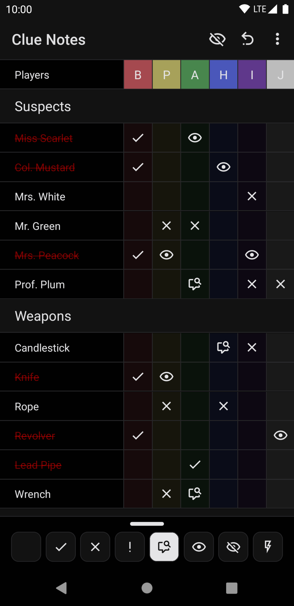
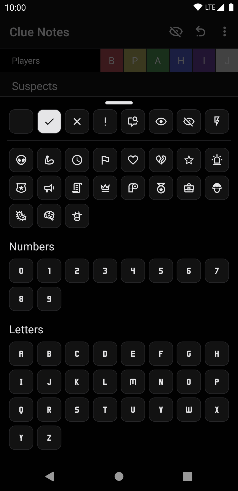

# clue-notes

A simple React Native Clue's note taking application to replace the paper form of taking notes about the characters, weapons, and rooms. 

The application is open source and also available on the [Google Play Store](https://play.google.com/store/apps/details?id=com.cluenotes)

